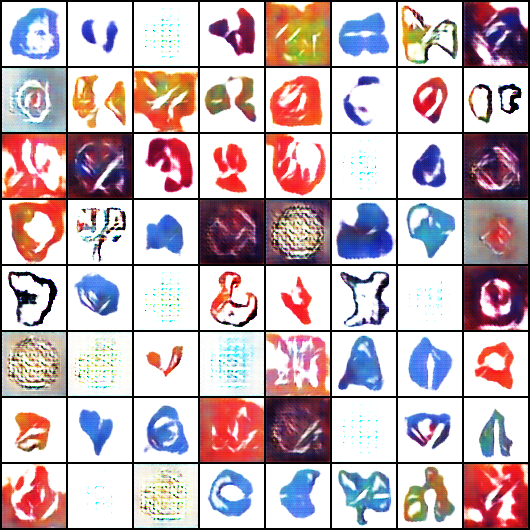

# LogoGan
Este repositorio contiene los notebooks referentes al módulo de implementación y uso de "GANs" en problemas complejos de AI. Este curso es impartido en colaboración con el [Colegio de Matemáticas Bourbaki](https://www.colegio-bourbaki.com/)

Esbozaré un enfoque para crear GAN convolucionales profundas, o DCGAN para abreviar. Todo esto significa que las redes neuronales que estoy usando son redes neuronales convolucionales, en lugar de redes lineales estándar.

Estoy usando un conjunto de datos reducido, con imágenes de más de 2000 logos. Para las GAN, ~ 2000 imágenes es un pequeño conjunto de datos; Para resolver este problema, utilicé transformaciones de PyTorch para crear imágenes de entrenamiento reflejadas y de diferentes colores. Esto triplicó el tamaño de mis datos de entrenamiento y obtuve resultados mucho mejores.

## Modelo

### Discriminator

Este discriminador presenta 5 capas convolucionales y capas LeakyReLU para funciones de activación. La normalización por lotes se realiza después de cada etapa convolucional, excepto en la salida.

Elegí establecer un número alto constante de filtros para mis capas en lugar de subir a un número alto y detenerme. Experimenté un mejor rendimiento al ejecutar valores de filtro constantes que al ejecutar valores cambiantes. Esto llevó a mi decisión de llegar a 128 filtros lo antes posible y permanecer allí hasta la última capa.

### Generator
Esto presenta capas de transposición convolucional, que se utilizan para muestrear el vector de entrada aleatoria en una imagen completa. A diferencia del discriminador, cuyo objetivo es condensar una imagen en un valor único, real o falso, el generador toma un vector aleatorio y lo convierte en una imagen. Estas capas lo hacen posible al expandir el vector hasta que sea un Logo de aspecto (con suerte) realista.

Para la implementación se han usado principalmente las siguientes referencias
- Jovian.ml DCGAN example from PyTorch Zero to GANs Course: https://jovian.ml/aakashns/06b-anime-dcgan
- Tips and tricks about training GANs: https://medium.com/@utk.is.here/keep-calm-and-train-a-gan-pitfalls-and-tips-on-training-generative-adversarial-networks-edd529764aa9